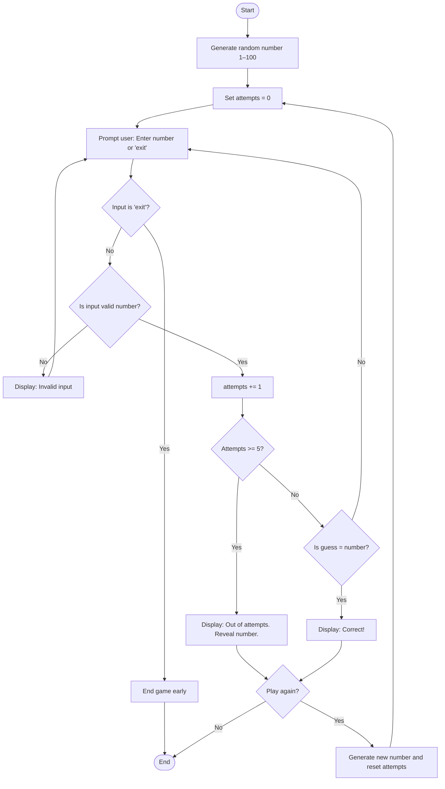

# Guessing.md

# Guessing Game – Flowchart

This version of the guessing game includes:
- A random number between 1–100
- Exit option by typing `'exit'`
- A maximum of 5 attempts before the game ends

---

# Description of Flow

- **Start**: The game initializes.
- **A & B**: Random number is generated; attempts counter set to 0.
- **C**: The user is prompted to guess or exit.
- **D**: If they type “exit”, game ends immediately.
- **F**: Validates the input.
- **H**: Increments attempts.
- **I**: If attempts ≥ 5, user loses.
- **K**: If guess is correct, show success message.
- **M**: User chooses whether to play again.

---
